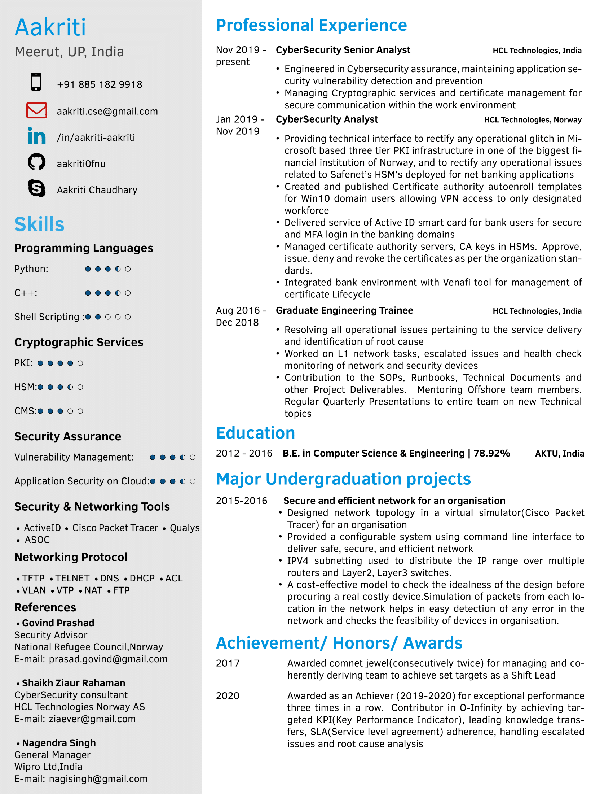

# Aakriti's Resume

## Installing pre-requisites:
1. [Overleaf:An online LaTeX editor](www.overleaf.com) 

## Output:


## Credits:
Especial thanks to the below authors who's resume templates helped me to create my own. 
1. [Carmine Spagnuolo's Twenty Seconds Curriculum Vitae](https://github.com/spagnuolocarmine/TwentySecondsCurriculumVitae-LaTex)
2. [Carmine Benedetto's Smart Fancy LaTeX CV](https://github.com/neoben/smart-fancy-latex-cv)
3. [Adrien Friggeri's Fancy CV](https://www.sharelatex.com/templates/52fb8c1f33621a613683ecad)
4. [Harshavardhan Gadgil's modifications](https://github.com/opensorceror/Data-Engineer-Resume-LaTeX)
5. Vel (vel@LaTeXTemplates.com)

## License
```
Copyright 2016 Harshavardhan Gadgil

Licensed under the Apache License, Version 2.0 (the "License");
you may not use this file except in compliance with the License.
You may obtain a copy of the License at

   http://www.apache.org/licenses/LICENSE-2.0

Unless required by applicable law or agreed to in writing, software
distributed under the License is distributed on an "AS IS" BASIS,
WITHOUT WARRANTIES OR CONDITIONS OF ANY KIND, either express or implied.
See the License for the specific language governing permissions and
limitations under the License.
```